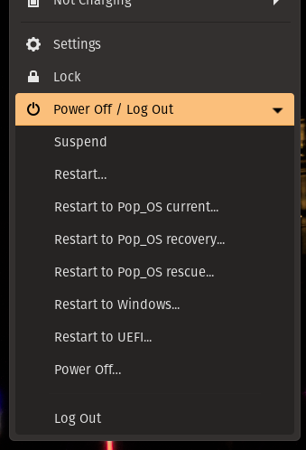

# Reboot to ...

This is a small Gnome extension that adds the ability to reboot directly to an entity of the boot-loader. This is a fork of the way better extentions [Reboot to UEFI](https://github.com/UbayGD/reboottouefi) by [UbayGD](https://github.com/UbayGD/). This will also add the UEFI entry to the menu, so you don't need both extensions.

This extension rely on the DBus interface `org.freedesktop.login1` to both discover entries and request the reboot.

 

# Build the extension

To build the extension run the following command:

`$ sh build.sh`

If all goes well this will generate a zip file in the project folder.

# Install the extension

To install the extension just run the **install.sh** script with the following command:

`$ sh install.sh`

 

<!-- # Notes

- This extension is available in [GNOME Extensions](https://extensions.gnome.org/extension/5105/reboottouefi/). -->
